# Scenario & Parameter Guide — Maldives Energy CBA

> **Purpose:** A visual, structured reference to understand how scenarios, parameters, constraints, and outputs are connected. Start here if you're new to the model or need to trace how any number flows through the system.

### Related documents

| Document | What it covers | When to use |
|---|---|---|
| [IMPROVEMENT_PLAN.md](IMPROVEMENT_PLAN.md) | Master plan: all tasks (C1–C10, M1–M7, L1–L25, V1–V8, R1–R15, P1–P8), decision log (D1–D74), human lookup table (H1–H17) | Before/after every task — single source of truth for work |
| [CBA_METHODOLOGY.md](CBA_METHODOLOGY.md) | 40+ equations (LaTeX), ~210 parameter traces (CSV→config→script), 17 structural concerns | Before changing any formula, parameter, or config wiring |
| [AUDIT_REPORT.md](AUDIT_REPORT.md) | Living record of bugs found/fixed, wiring audits, formula checks (15/15 resolved) | When fixing bugs or discovering issues |
| [.github/copilot-instructions.md](../.github/copilot-instructions.md) | Coding rules: zero hardcoded values, 3-step parameter wiring, Perplexity workflow, file map | Always — defines how code must be written |
| [parameters.csv](model/parameters.csv) | All ~210 parameter values with sources, Low/High ranges | When adding/changing any number |

### How these documents connect

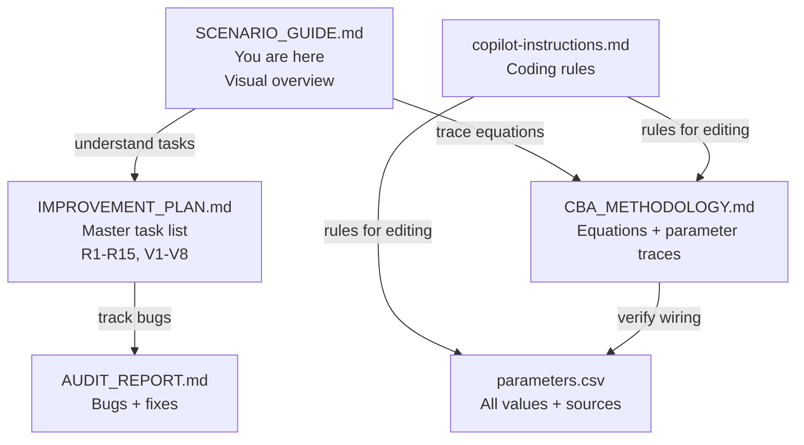

---

## 0 — Are 7 Scenarios Enough?

### Current scenario coverage

The 7 scenarios span **three strategic dimensions**:

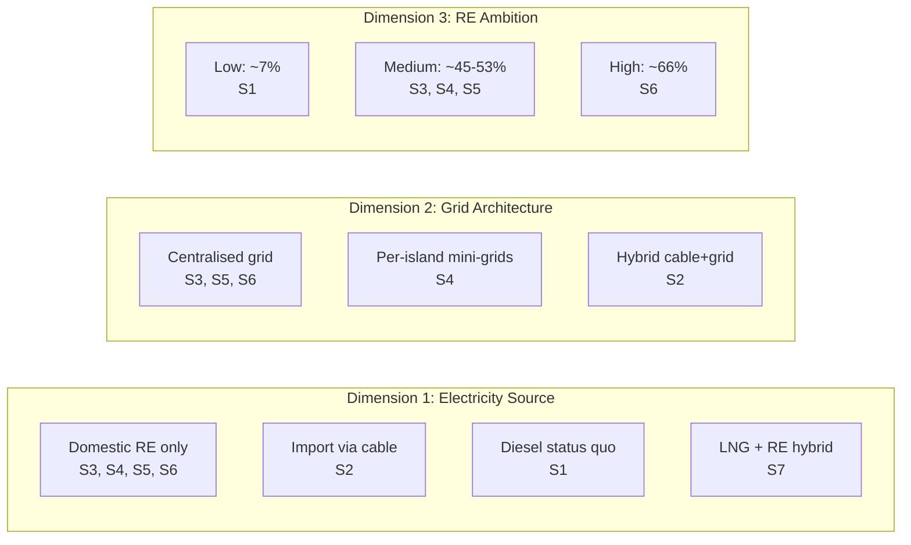

### What IS well covered

| Decision question | Scenarios that answer it |
|---|---|
| Should we stay on diesel? | S1 vs all others |
| India cable — worth it? | S2 vs S3 (same grid, different source) |
| Grid vs islanded? | S3 vs S4 (same RE, different architecture) |
| How much solar can Male absorb? | S3 → S5 → S6 (progressive Malé unlocking) |
| How far can we push RE? | S3 (50%) → S5 (53%) → S6 (66%) |
| Is LNG a cost-effective bridge fuel? | S7 vs S3 (same outer islands, different Malé fuel) |
| What is the MCA-optimal path? | S6 wins on MCA; S7 wins on BCR |

### What is NOT covered — the gaps

| Gap | Why it matters | Fix needed? |
|---|---|---|
| ~~**LNG transition** (140–400 MW)~~ | ~~Government's top near-term priority per Roadmap.~~ **✅ IMPLEMENTED as S7.** 140 MW LNG at Gulhifalhu, outer islands RE as S3. Total costs $14.6B, emissions 22.8 Mt, LCOE $0.20/kWh. | **Done — S7 implemented** |
| **WTE baseload** (14 MW) | Roadmap: 12 MW Thilafushi + 1.5 Addu + 0.5 Vandhoo = ~98 GWh/yr at 80% CF. Adds ~4% RE for free. Currently missing from all scenarios. | **No new scenario needed** — add WTE as a technology within S3–S6 via R6 |
| ~~**33%-by-2028 sprint**~~ | ~~Is the Roadmap's flagship target feasible? What does it cost in a 4-year window?~~ **✅ ASSESSED:** Not feasible — max 22% by 2028. 33% achievable by 2030. See §13. | **Done — R15 analysis in §13** |
| **Demand uncertainty** | What if growth is 3% (recession) or 8% (Malé boom)? | **No new scenario** — handled by sensitivity/MC analysis on growth_rate param |
| **Technology cost shocks** | What if solar drops to $800/kW? Or battery hits $150/kWh? | **No new scenario** — handled by sensitivity analysis on capex params |
| **Subsidy reform** | What is the fiscal impact of eliminating $200M/yr fuel subsidy? | **No new scenario** — add as benefit stream via R8, applies to all S2–S7 |
| **Resort integration** | What if resort demand (1,050 GWh) enters the utility grid? | **Not recommended** — resorts are off-grid, self-generated. Different economics. Document via R7 scope boundary. |

### Verdict: All 7 scenarios implemented ✅

**All 7 scenarios are now implemented, including S7 LNG Transition.** The original rationale for adding S7:

1. **LNG is structurally different** from all existing scenarios. It changes the *fuel*, not the electricity topology. It sits between S1 (diesel) and S3 (full RE) in both cost and emissions. No combination of sensitivity parameters on S1–S6 can replicate it.

2. **LNG is the government's near-term priority.** The Roadmap devotes an entire flagship intervention to it. Not modelling it means we cannot answer "should Maldives do LNG before RE?" — arguably the most policy-relevant question.

3. **Everything else fits into existing scenarios:**
   - WTE → technology addition to S3–S6 (R6, no new scenario)
   - Subsidy avoidance → benefit stream in NPV (R8, no new scenario)
   - 33% target → short-horizon analytical run (R15, no new scenario)
   - Demand/cost uncertainty → sensitivity analysis (existing infrastructure)

### S7: LNG Transition (✅ implemented)

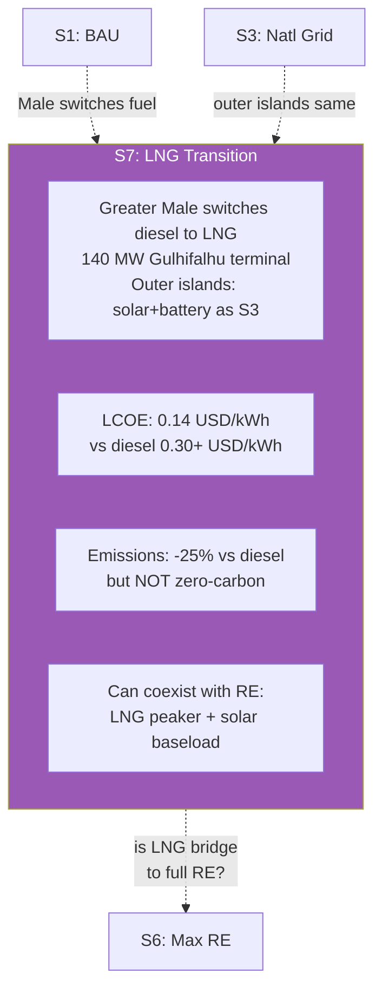

| Property | S7: LNG Transition |
|---|---|
| **Malé power** | LNG 140 MW at Gulhifalhu (replaces diesel from 2031) |
| **Outer islands** | Solar+battery as S3 (50 MW/yr ramp) |
| **Grid** | Inter-island cables as S3 |
| **LCOE** | $0.196/kWh blended (lowest of all scenarios) |
| **PV Total Costs** | $6,235M (lowest) |
| **BCR** | 9.32 (highest) |
| **Emissions** | 22.8 MtCO₂ (−66% vs BAU) |
| **National RE** | 50.2% final year (same as S3 — outer islands identical) |
| **MCA Score** | 0.713 (Rank #2, behind S6 Maximum RE) |
| **Key insight** | LNG is the most cost-effective scenario — lowest LCOE and highest BCR. However, it ranks #2 on MCA because S6 scores higher on environmental impact and energy security. |

**Implementation:** R9 completed. File: `model/scenarios/lng_transition.py`. Config: `LNGConfig` in `config.py`. Parameters: 13 LNG + 3 MCA scores in `parameters.csv`.

### Decision framework: when to add a new scenario vs. not

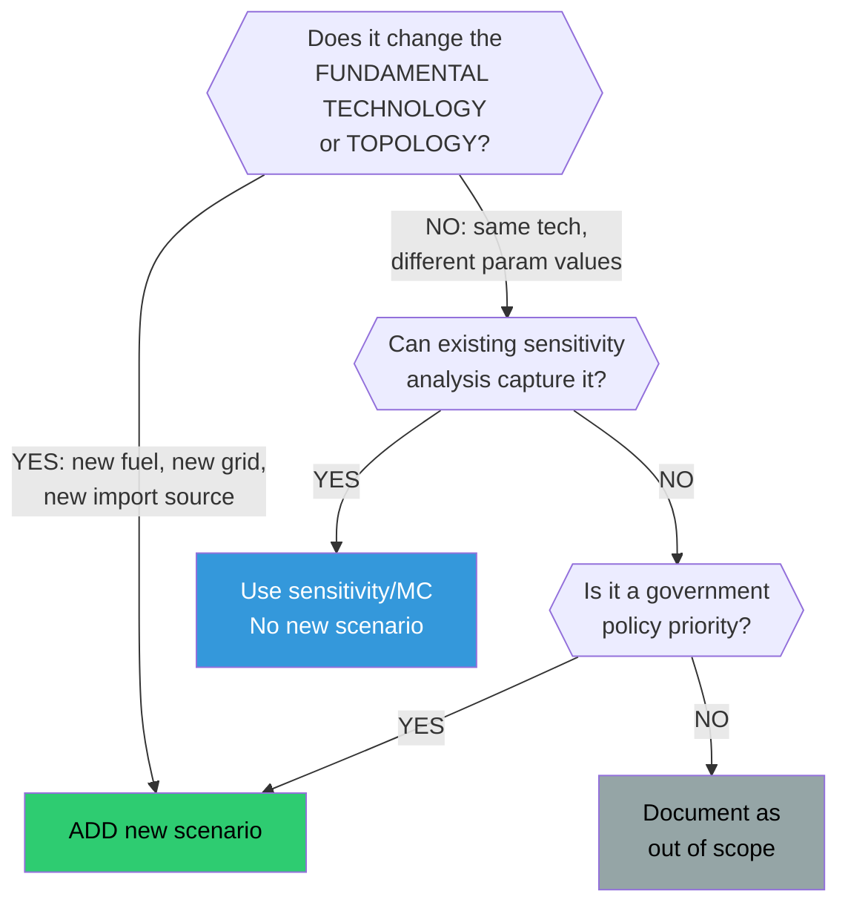

**Examples:**
- LNG → new fuel → **new scenario** (S7)
- WTE 14 MW → new tech but small, fits inside S3–S6 → **technology addition**
- Solar at $800/kW → same tech, different price → **sensitivity analysis**
- Resort integration → different market segment → **out of scope** (document why)

---

## 1 — The Big Picture

### How the model works (data flow)

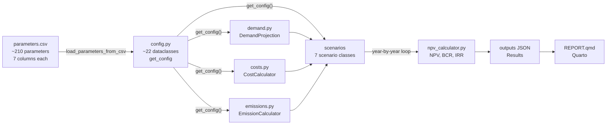

### What each scenario represents

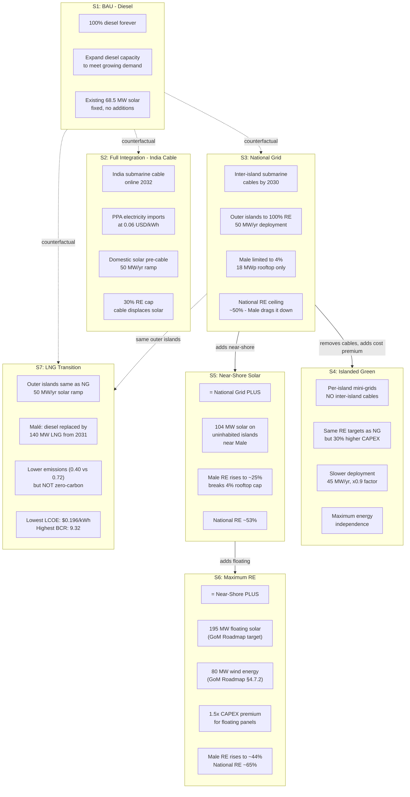

---

## 2 — Scenario Comparison Matrix

### What's included in each scenario

| Component | S1 BAU | S2 Full Integ | S3 Natl Grid | S4 Islanded | S5 Near-Shore | S6 Max RE | S7 LNG Trans |
|---|:---:|:---:|:---:|:---:|:---:|:---:|:---:|
| **Demand growth rate** | 5% | 5% | 4% | 4% | 4% | 4% | 4% |
| **Outer island solar** | — | ✅ (pre-cable) | ✅ 50 MW/yr | ✅ 45 MW/yr | ✅ 50 MW/yr | ✅ 50 MW/yr | ✅ 50 MW/yr |
| **Malé rooftop solar** | fixed | ✅ 18 MWp | ✅ 18 MWp | ✅ 18 MWp | ✅ 18 MWp | ✅ 18 MWp | ✅ 18 MWp |
| **Near-shore solar (104 MW)** | — | — | — | — | ✅ | ✅ | — |
| **Floating solar (195 MW)** | — | — | — | — | — | ✅ | — |
| **LNG 140 MW (Malé)** | — | — | — | — | — | — | **✅ (2031)** |
| **India submarine cable** | — | ✅ (2032) | — | — | — | — | — |
| **Inter-island grid** | — | ✅ (2027-28) | ✅ (by 2030) | — | ✅ (by 2030) | ✅ (by 2030) | ✅ (by 2030) |
| **Battery storage** | — | ✅ 1.5 MWh/MW | ✅ 3.0 MWh/MW | ✅ 3.0 MWh/MW | ✅ 3.0 MWh/MW | ✅ 3.0 MWh/MW | ✅ 3.0 MWh/MW |
| **CAPEX premium** | — | — | — | **+30%** | — | **+50%** (float) | — |
| **OPEX premium** | — | — | — | **+20%** | — | — | — |
| **Supply security costs** | — | ✅ $8M/yr | — | — | — | — | — |
| **PPA electricity imports** | — | ✅ | — | — | — | — | — |
| **Induced demand** | — | ✅ (ε=-0.3) | — | — | — | — | — |
| **Connection costs** | — | ✅ $200/HH | ✅ $200/HH | ✅ $260/HH | ✅ $200/HH | ✅ $200/HH | ✅ $200/HH |
| **Diesel backup** | 100% | 20% of peak | 20% of peak | 20% of peak | 20% of peak | 20% of peak | 20% of peak |
| **Max RE share** | ~7% | ~30% cap | ~50% | ~45% | ~53% | ~55% | ~50% |

### The "scenario ladder" — each builds on the previous

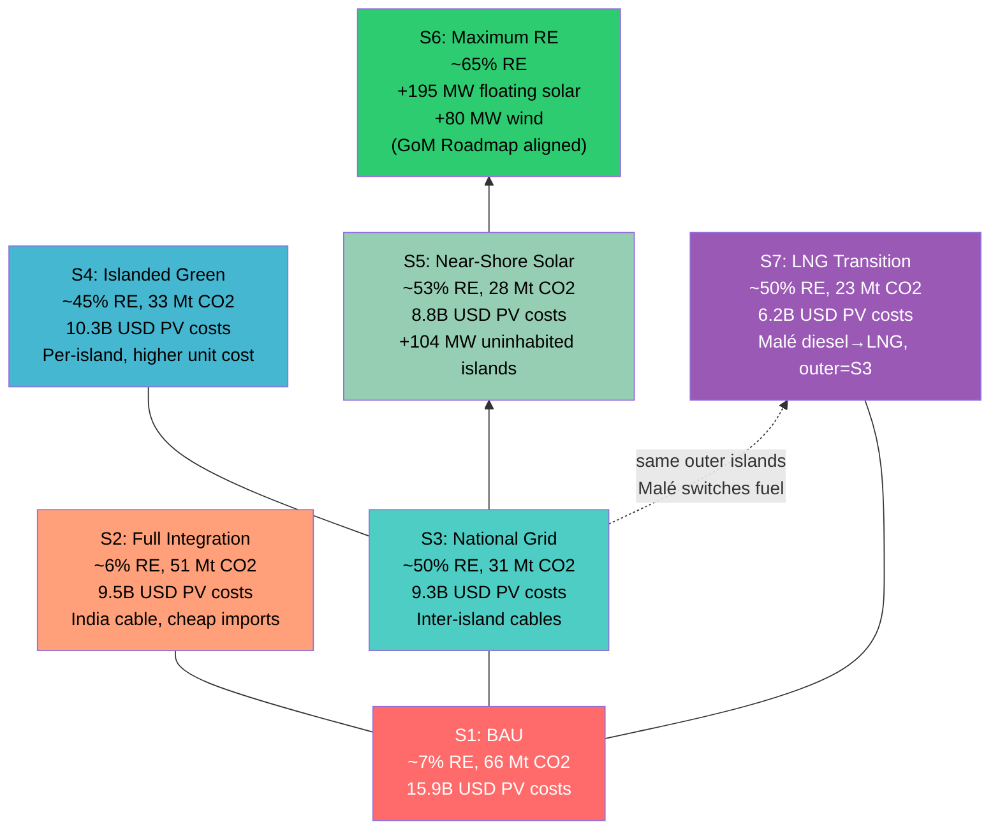

---

## 3 — Parameter Universe

### How parameters flow through the system

```mermaid
flowchart LR
    subgraph CSV["parameters.csv"]
        P1["Category"]
        P2["Parameter"]
        P3["Value"]
        P4["Low / High"]
        P5["Unit / Source"]
    end

    subgraph CONFIG["config.py dataclasses"]
        DC1["DemandConfig"]
        DC2["OneGridConfig"]
        DC3["GreenTransitionConfig"]
        DC4["TechnologyConfig"]
        DC5["EconomicsConfig"]
        DC6["FuelConfig"]
        DC7["NearShoreConfig"]
        DC8["FloatingSolarConfig"]
        DC9["SupplySecurityConfig"]
        DC10["CableOutageConfig"]
        DC11["HealthConfig"]
        DC12["ClimateAdaptConfig"]
        DC13["EnvironmentConfig"]
        DC14["etc"]
    end

    subgraph SCENARIOS["Scenario files"]
        S1["status_quo.py"]
        S2["one_grid.py"]
        S3["green_transition.py"]
        S4["islanded_green.py"]
        S5["nearshore_solar.py"]
        S6["maximum_re.py"]
        S7["lng_transition.py"]
    end

    CSV -->|load_parameters_from_csv| CONFIG
    CONFIG -->|"cfg = get_config()"| SCENARIOS
```

### Parameter categories and counts

| Category | # Params | Example Parameters | Used By |
|---|---|---|---|
| **Current System** | 8 | installed_capacity, solar_pv_capacity, male_electricity_share | All scenarios |
| **Demand** | 6 | base_demand, base_peak, growth rates (BAU/NG/FI) | demand.py → all |
| **Fuel** | 4 | diesel_price, fuel_efficiency, fuel_escalation | costs.py → all |
| **Solar PV** | 7 | capex, opex, lifetime, CF, degradation, decline_rate | costs.py → S2-S7 |
| **Battery** | 7 | capex, opex, lifetime, DoD, RT efficiency, decline_rate | costs.py → S2-S7 |
| **Diesel Gen** | 4 | capex, opex, lifetime, min_load | costs.py → all |
| **Economics** | 3 | discount_rate, base_year, project_life | npv_calculator → all |
| **India Cable** | 15 | capacity, cable_capex, converter, landing, IDC, grid_upgrade... | S2 only |
| **PPA** | 4 | import_price, transmission_charge, escalation, India EF | S2 only |
| **Green Transition** | 12 | ramp, male_max_re, battery_ratio, inter-island grid... | S3, S4, S5, S6, S7 |
| **Near-Shore** | 4 | nearshore_mw, cable_cost_per_mw, build_start, build_years | S5, S6 |
| **Floating Solar** | 4 | floating_mw, capex_premium, build_start, build_years | S6 only |
| **LNG** | 10 | plant_capacity_mw, capex_per_mw, fuel_cost, emission_factor, online_year, cf... | S7 only |
| **Islanded** | 4 | cost_premium, battery_ratio, opex_premium, re_cap_factor | S4 only |
| **Losses** | 2 | distribution_loss, hvdc_cable_loss | costs.py → all / S2 |
| **Health** | 2 | health_damage_cost, diesel reduction GWh | npv → S2-S7 |
| **Climate Adapt** | 2 | adaptation_premium, applied to solar/battery/cable CAPEX | costs.py → S2-S7 |
| **Supply Security** | 4 | idle_fleet_cost, outage_rate, outage_duration, fuel_premium | S2 only |
| **Emissions** | 4 | emission_factor, SCC, SCC_growth, India_factor | emissions.py → all |
| **Connection** | 3 | cost_per_hh, total_hh, rollout_years | S2-S7 |
| **Environment** | 3 | noise, spill, biodiversity externalities | All (vs BAU) |
| **Malé Density** | 3 | male_growth, male_min_share, male_saturation_year | demand share → S3-S6 |
| **MCA** | ~20 | 8 weights + qualitative scores per scenario | mca_analysis.py |
| **Transport** | 25 | fleet size, EV share, adoption curve, fuel/energy, health damage, charging infra | transport_analysis.py |
| **Other** | ~15 | benchmarks, financing, distributional, tourism, dispatch | Various modules |

---

## 4 — Constraints & Reality Checks

### Physical and policy constraints by scenario

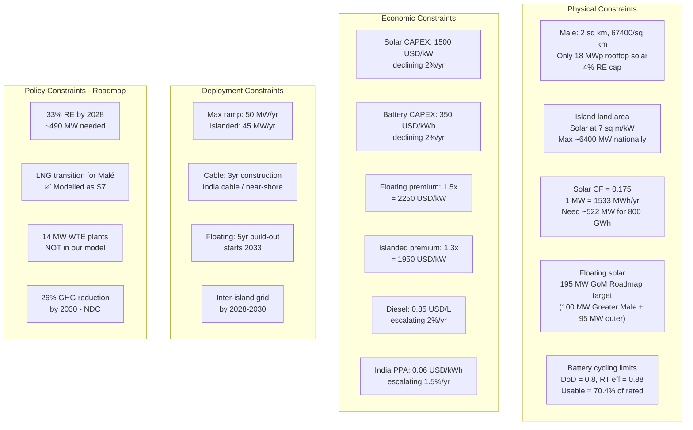

### The Malé problem — why it drives everything

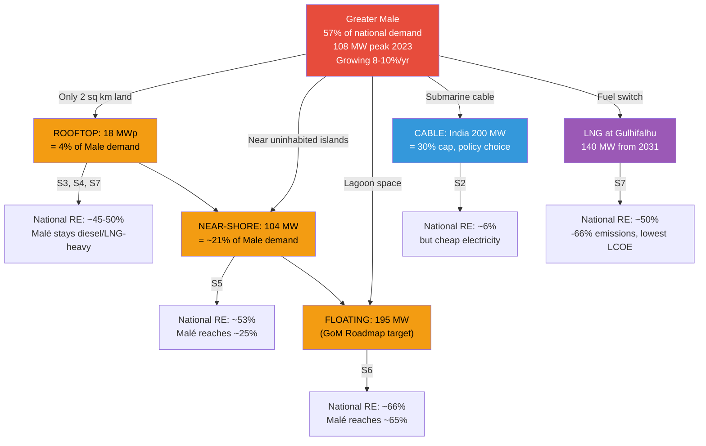

### Key: Malé is the bottleneck for national RE share

Because Malé consumes **57% of non-resort electricity** but has almost **zero land for solar**, every scenario's national RE ceiling is determined by how much RE you can get *to* Malé:

| Solution | RE for Malé | National RE ceiling | Scenario |
|---|---|---|---|
| Rooftop only (18 MWp) | ~4% | ~50% | S3, S4, **S7** |
| + Near-shore (104 MW) | ~25% | ~53% | S5 |
| + Floating (195 MW) | ~44% | ~55% | S6 |
| India cable (200 MW) | N/A (imported) | ~6% (RE), but cheap | S2 |
| LNG (140 MW) | 0% RE (-44% CO₂) | ~50% (Malé still fossil) | **S7** |

---

## 5 — Parameter Dependency Graph

### Which parameters affect which scenarios

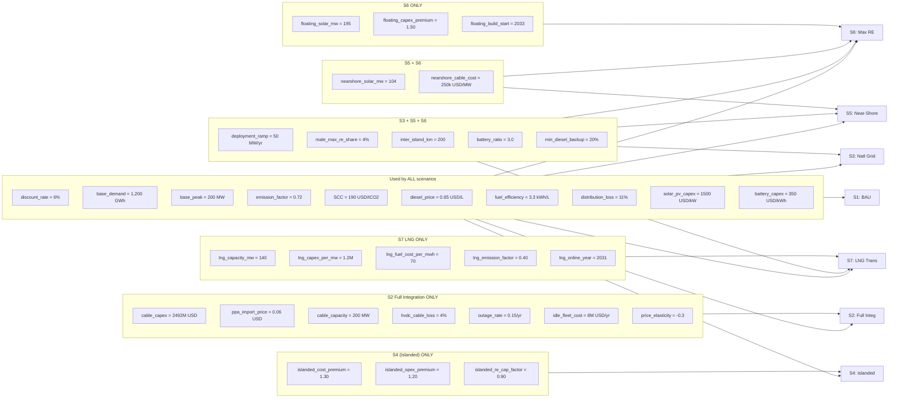

---

## 6 — How RE Share Is Computed (the core formula)

### The RE share formula varies by scenario segment

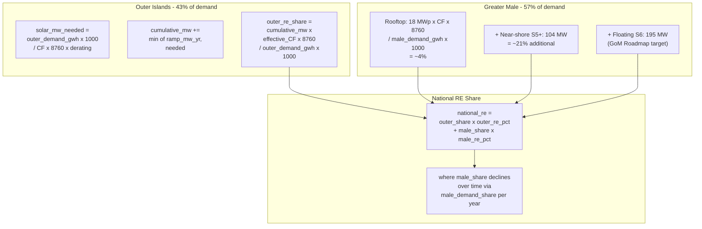

### Year-by-year trajectory (stylised)

```
Year     BAU    FI     NG     IG     NS     MX     LNG
2026     7%     7%     7%     7%     7%     7%     7%
2028     7%     9%    12%    11%    14%    14%    12%
2030     7%    12%    22%    19%    27%    27%    22%
2032     7%    15%    33%    29%    38%    38%    33%
2034     7%     6%    42%    37%    47%    50%    42%
         ↑      ↑                          ↑      ↑
      no solar  cable online,           floating  LNG online
      additions  solar stops,           starts    2031, same
                 imports dominate       2033      RE as NG
2040     7%     6%    49%    44%    52%    62%    49%
2050     7%     6%    50%    45%    53%    66%    50%
```

---

## 7 — Output Metrics

### What the model produces per scenario

| Metric | Formula | Unit | Meaning |
|---|---|---|---|
| **PV of Total Costs** | Σ discounted (CAPEX + OPEX + Fuel + PPA) | $M | Total lifecycle cost at 6% discount |
| **NPV** | PV(benefits) − PV(incremental costs vs BAU) | $M | Net social value of switching from BAU |
| **BCR** | PV(benefits) / PV(incremental costs) | ratio | >1 means benefits exceed costs |
| **IRR** | Rate r where NPV(r) = 0 | % | Internal rate of return |
| **Payback Period** | Year when cumulative benefits ≥ cumulative costs | years | Time to recover investment |
| **Final RE Share** | RE generation / total generation in final year | % | Endpoint renewable fraction |
| **Cumulative Emissions** | Σ annual CO₂ over project life | Mt CO₂ | Total carbon footprint |
| **MCA Score** | Weighted sum of 8 normalised criteria | 0-1 | Multi-criteria ranking |
| **LCOE** | PV(all costs) / PV(all generation) | $/kWh | Levelised unit cost |

### Current model results (validated Feb 2026)

| Scenario | PV Costs | BCR | Final RE | Emissions | MCA Score | MCA Rank |
|---|---|---|---|---|---|---|
| S1: BAU | $15,898M | — | 1.5% | 66.6 Mt | — | — |
| S2: Full Integ | $9,451M | 4.24 | 6.2% | 51.0 Mt | 0.100 | #6 |
| S3: Natl Grid | $9,264M | 7.05 | 50.2% | 30.6 Mt | 0.519 | #5 |
| S4: Islanded | $10,276M | 5.48 | 45.4% | 33.1 Mt | 0.548 | #4 |
| S5: Near-Shore | $8,823M | 6.49 | 53.2% | 28.0 Mt | 0.606 | #3 |
| S6: Max RE | $7,532M | 5.39 | 66.2% | 18.5 Mt | 0.726 | **#1** |
| **S7: LNG Trans** | **$6,235M** | **9.32** | 50.2% | 22.8 Mt | 0.713 | **#2** |

---

## 8 — Roadmap Alignment (which scenario matches government policy?)

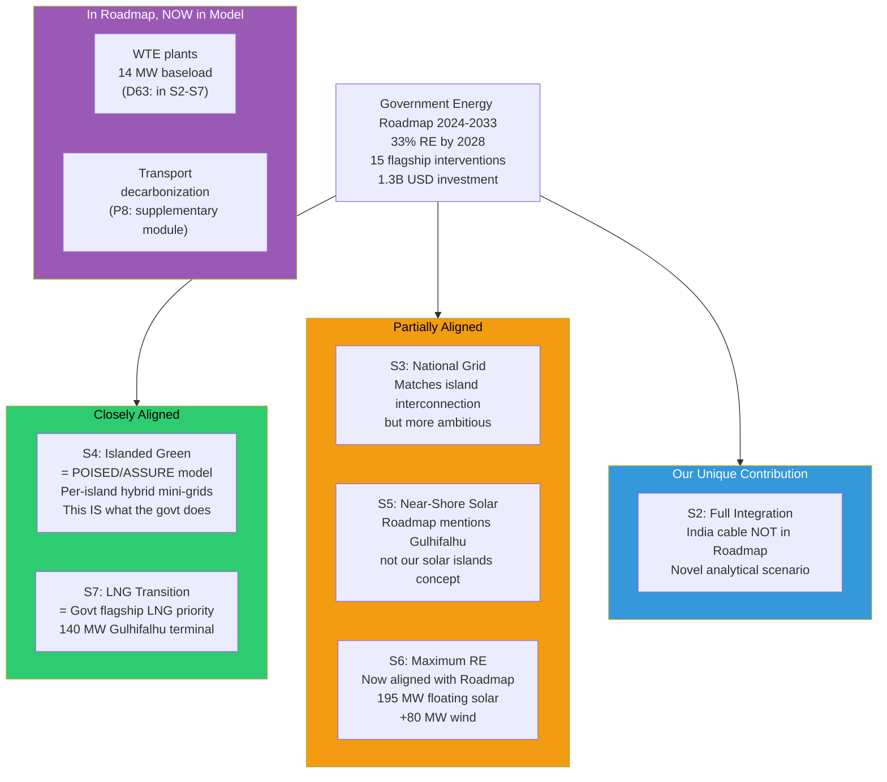

---

## 9 — Quick Reference: "Where does this number come from?"

### If you see a number in the report and want to trace it:

```
1. Report says "$1,500/kW solar CAPEX"
   → outputs/cba_results.json (rendered by REPORT.qmd)
   → scenarios/*.py used cfg.technology.solar_pv_capex
   → config.py TechnologyConfig.solar_pv_capex
   → parameters.csv row: Category="Solar", Parameter="Solar PV CAPEX"
   → Source column: "IRENA RPGC 2024 for SIDS"

2. Report says "BCR = 7.05 for National Grid"
   → outputs/cba_results.json
   → npv_calculator.py compute_bcr()
   → benefits (fuel saved, emissions avoided, health) / incremental costs
   → Each benefit computed from scenario.compute_annual_data()
   → Each cost from costs.py using get_config() parameters
```

### The 3-step parameter addition rule

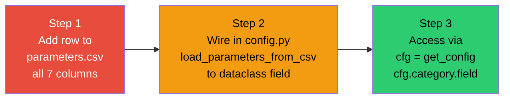

---

## 10 — Sensitivity: Which Parameters Matter Most?

Parameters are ranked by their impact on NPV (from tornado analysis):

| Rank | Parameter | Low → High Range | Affects | Why It Matters |
|---|---|---|---|---|
| 1 | `discount_rate` | 4% → 8% | All scenarios | Dominates PV of all future cash flows |
| 2 | `diesel_price` | $0.60 → $1.10/L | BAU costs, fuel savings | Directly scales the counterfactual |
| 3 | `solar_pv_capex` | $1,200 → $1,800/kW | RE scenarios CAPEX | Single largest investment |
| 4 | `growth_rate` | 3% → 7% | Demand in all years | Compound effect over 30 years |
| 5 | `fuel_escalation` | 1% → 3%/yr | Diesel costs over time | Amplifies diesel price effect |
| 6 | `battery_capex` | $250 → $450/kWh | BESS investment | 2nd largest RE cost component |
| 7 | `emission_factor` | 0.65 → 0.80 kg/kWh | Emission benefits | Scales SCC-based benefits |
| 8 | `SCC` | $0 → $300/tCO₂ | Monetised emission savings | Large effect on BCR |
| 9 | `cable_capex` (S2 only) | $1.8B → $3.2B | FI scenario NPV | Makes or breaks the cable case |
| 10 | `health_damage_cost` | $20 → $60/MWh | Health co-benefits | Significant for diesel-heavy BAU |

---

## 11 — Generated Figures

Run `python -m model.visualize_scenarios` to regenerate. Saved to `outputs/figures/`.

| # | File | What it shows |
|---|---|---|
| 1 | `scenario_comparison.png` | 4-panel: costs, BCR, RE share, emissions |
| 2 | `technology_stack.png` | Technology mix per scenario (final year) |
| 3 | `male_constraint.png` | How each scenario powers Greater Malé |
| 4 | `parameter_sensitivity.png` | Tornado diagram — top 10 params |
| 5 | `deployment_timeline.png` | RE share trajectory 2026–2055 |
| 6 | `scenario_tree.png` | How scenarios build on each other |
| 7 | `parameter_flow.png` | CSV → Config → Model → Scenarios → Outputs (networkx) |
| 8 | `roadmap_gap.png` | Official Roadmap targets vs model capabilities |

---

## 12 — R1–R15 Implementation Plan (Roadmap Calibration)

### Sequencing rationale

The 15 tasks fall into **4 natural phases**. Each phase produces a stable, runnable model before the next begins. Dependencies flow top-down — a later phase never blocks an earlier one.

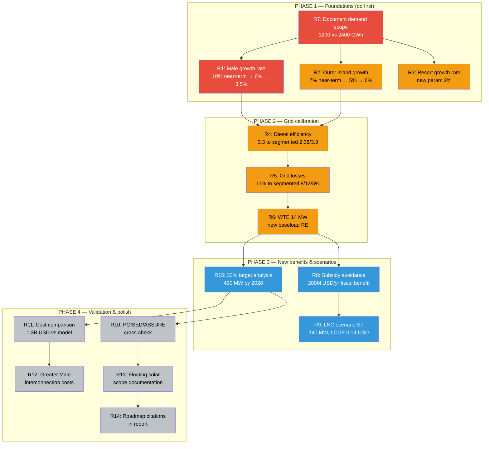

### Phase 1 — Demand Foundations (🔴 do first)

| Task | What changes | Files touched | Effort | Risk |
|---|---|---|---|---|
| **R7** | ✅ Add clear documentation that `base_demand_2026 = 1,200 GWh` = non-resort only. Total national = 2,250 GWh when resort 1,050 GWh added. No code changes — pure documentation. | `parameters.csv` (Notes col), `SCENARIO_GUIDE.md`, `CBA_METHODOLOGY.md` | ✅ Done | — |
| **R1** | ✅ Add `male_demand_growth_rate_near_term = 0.10` for 2026–2035, tapering to 6% long-term, then 3.5% post-peak (D71 three-phase model). | `parameters.csv`, `config.py`, `demand.py`, all scenarios | ✅ Done | — |
| **R2** | ✅ Add `outer_island_growth_rate = 0.07` near-term, tapering to 5% by 2030, then 6% post-peak (D71 three-phase model). | `parameters.csv`, `config.py`, `demand.py` | ✅ Done | — |
| **R3** | ✅ Add `resort_growth_rate = 0.02` as separate param. Currently resorts not in demand model scope. | `parameters.csv`, `config.py` | ✅ Done | — |

**Phase 1 outcome:** ✅ Demand trajectory matches Roadmap's segment-specific patterns. Malé growth now realistic (~10% near-term, tapering via three-phase model D71). All 7 scenarios re-run with updated demand.

### Phase 2 — Grid Calibration (🟡 improves accuracy)

| Task | What changes | Files touched | Effort | Risk |
|---|---|---|---|---|
| **R4** | ✅ Split `diesel_fuel_efficiency` into `male_diesel_efficiency = 3.3` and `outer_diesel_efficiency = 2.38`. Costs.py already uses per-island data in `least_cost.py` — wire segmented values through main scenarios. | `parameters.csv`, `config.py`, `costs.py` | ✅ Done | — |
| **R5** | ✅ Replace `distribution_loss = 0.11` with `male_grid_loss = 0.08`, `outer_grid_loss = 0.12`, `target_grid_loss = 0.05`, `loss_improvement_year = 2028`. | `parameters.csv`, `config.py`, `costs.py`, scenarios | ✅ Done | — |
| **R6** | ✅ Add 14 MW WTE (12 MW Thilafushi + 1.5 Addu + 0.5 Vandhoo). New `WTEConfig` dataclass. 80% CF → ~98 GWh/yr baseload. Feeds into RE share and displaces diesel. | `parameters.csv`, `config.py`, `costs.py`, all scenarios except BAU | ✅ Done | — |

**Phase 2 outcome:** ✅ Grid losses and diesel efficiency properly segmented by island group. WTE adds ~4% RE without any solar. Scenarios now more granular and accurate.

### Phase 3 — New Benefits & Scenarios (🔵 expands model)

| Task | What changes | Files touched | Effort | Risk |
|---|---|---|---|---|
| **R8** | ✅ Add `avoided_subsidy_benefit` to NPV calculation as fiscal benefit of RE. Each GWh of diesel replaced saves proportional subsidy. $0.15/kWh. | `parameters.csv`, `config.py`, `npv_calculator.py` | ✅ Done | — |
| **R9** | **✅ DONE:** S7 LNG Transition implemented. 140 MW Gulhifalhu, outer islands same as S3. PV costs $6.2B, BCR 9.32, LCOE $0.196/kWh, 22.8 MtCO₂. | `lng_transition.py`, `parameters.csv`, `config.py`, `run_cba.py`, `mca_analysis.py`, `npv_calculator.py` | ✅ Done | — |
| **R15** | **✅ DONE:** 33% RE by 2028 is NOT feasible — best case ~22% (50 MW/yr) or ~24% (full pipeline 232 MW). Target needs 325 MW = 128 MW/yr = 2.6× current ramp. ~$594M investment. 33% achievable by 2030 in S3–S7. See §13. | Analysis + documentation (SCENARIO_GUIDE §13) | ✅ Done | — |

**Phase 3 outcome:** ✅ NPV includes subsidy avoidance benefit ($0.15/kWh). 33% target explicitly assessed (not feasible by 2028; achievable by 2030). S7 LNG Transition implemented.

### Phase 4 — Validation & Polish (⚪ no model changes)

| Task | What changes | Files touched | Effort | Risk |
|---|---|---|---|---|
| **R10** | **✅ DONE:** POISED (28 MW, 126 islands, $4.6M/MW) and ASSURE (20 MW, $4.0M/MW) validated against model S4. 2× cost ratio explained by project delivery overhead. See §14. | Documentation (SCENARIO_GUIDE §14) | ✅ Done | — |
| **R11** | **✅ DONE:** Roadmap $1.3B vs model $913M (0.70×). Gap ($387M) = delivery overhead, institutional costs, contingencies. Per-MW: Roadmap $3.9M vs model $2.2M = 1.8× ratio. See §14. | Documentation (SCENARIO_GUIDE §14) | ✅ Done | — |
| **R12** | **✅ DONE:** Greater Malé Phase 2 (10km 132kV) = model $17.3M vs likely $20–30M actual. `inter_island_grid_capex_per_km=$1.5M/km` reasonable. See §14. | Documentation (SCENARIO_GUIDE §14) | ✅ Done | — |
| **R13** | **✅ DONE:** Model now uses Roadmap's 195 MW floating solar target (was 429 MW). Aligned with GoM/MCCEE (2024). | parameters.csv, config.py, maximum_re.py | ✅ Done | — |
| **R14** | **✅ DONE:** Roadmap citation + scenario framing table. S4="Roadmap-aligned" (POISED/ASSURE), S7="Flagship Intervention 8" (LNG). Key citations documented. See §14. | Documentation (SCENARIO_GUIDE §14) | ✅ Done | — |

**Phase 4 outcome:** ✅ Model validated against official data. Report framing documented. Scenarios contextualised within government planning.

### Total effort estimate

| Phase | Tasks | Effort | Priority |
|---|---|---|---|
| Phase 1 | R7, R1, R2, R3 | 4–5 hours | 🔴 Critical |
| Phase 2 | R4, R5, R6 | 7–8 hours | 🟡 Important |
| Phase 3 | R8, R9, R15 | 1–3 days | 🔵 Expands scope |
| Phase 4 | R10–R14 | 5–6 hours | ⚪ Polish |
| **Total** | **15 tasks** | **~4–6 days** | |

### How Phase 1 changes cascade

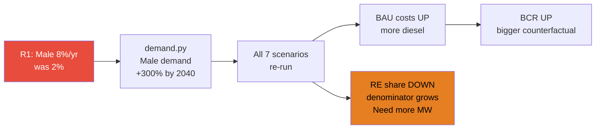

> ⚠️ **Key insight:** After R1 (Malé growth 8%), the Malé RE constraint becomes even tighter. Greater Malé demand explodes, but land-constrained solar can't follow. This makes the India cable (S2) and floating solar (S6) **even more important** — they're the only pathways to decarbonise Malé.

### V-task integration

Tier 4 validation tasks (V1–V8) should be addressed **in parallel** with R-tasks where overlapping:

| V-task | Overlaps with | Do together? |
|---|---|---|
| V3 (cable loss 3%→4% bug) | R5 (segmented losses) | ✅ Yes — fix the bug when refactoring losses |
| V2/V2b (sensitivity → 7 scenarios) | R1–R6 (demand/cost changes) | ✅ Yes — re-run sensitivity after all calibrations |
| V7 (solar area constraints) | R6 (WTE), R15 (33% target) | ✅ Yes — area check validates if 33% is feasible |
| V8 (financing → 7 scenarios) | R8 (subsidy avoidance) | ✅ Yes — extend financing analysis with subsidy data |
| V1, V4, V5, V6 | Independent | Do separately |

---

## 13 — R15: 33% RE by 2028 Feasibility Assessment ✅

The Maldives Energy Roadmap sets a flagship interim target of **33% renewable energy by 2028**. This section assesses whether that target is achievable given physical deployment constraints, the project pipeline, and model results.

### Model results: 2028 RE shares

| Scenario | 2028 Solar MW | 2028 Solar GWh | 2028 WTE GWh | 2028 Demand GWh | **2028 RE %** | 2030 RE % |
|---|---:|---:|---:|---:|---:|---:|
| S1 BAU | 68 | 99 | 0 | 1,466 | **6.8%** | 6.1% |
| S2 Full Integration | 218 | 318 | 0 | 1,466 | **21.7%** | 34.6% |
| S3 National Grid | 218 | 318 | 0 | 1,438 | **22.1%** | 35.9% |
| S4 Islanded Green | 204 | 296 | 0 | 1,438 | **20.6%** | 33.6% |
| S5 Near-Shore Solar | 218 | 316 | 0 | 1,438 | **21.9%** | 39.1% |
| S6 Maximum RE | 218 | 316 | 0 | 1,438 | **21.9%** | 39.1% |
| S7 LNG Transition | 218 | 318 | 0 | 1,438 | **22.1%** | 35.9% |

> **Key finding:** No scenario achieves 33% RE by 2028. The best cases (S2/S3/S5/S6/S7) reach only ~22%, driven by the 50 MW/yr deployment ramp constraint. WTE (98 GWh/yr) does not come online until 2029.

### Deployment ramp analysis

| Parameter | Value |
|---|---|
| Existing solar capacity (2026) | 68.5 MW |
| Model deployment ramp | 50 MW/yr |
| Max solar by 2028 (at 50 MW/yr) | 168 MW → 246 GWh |
| Effective solar CF (after temp derate, degradation) | 16.7% |
| 2028 demand (post-elasticity, S3–S7) | ~1,438 GWh |
| **RE achievable at 50 MW/yr** | **17.1%** |

### What would 33% require?

| Parameter | Value |
|---|---|
| RE generation needed for 33% | 475 GWh |
| Total solar MW needed | **325 MW** |
| Additional solar beyond 2026 base | 257 MW in 2 years |
| Required deployment ramp | **128 MW/yr** (2.6× current) |
| Scale-up factor (base → target) | 4.7× |
| Solar CAPEX ($1,500/kW + 7.5% adaptation) | **$414M** |
| Associated BESS (128 MW / 514 MWh at $350/kWh) | **$180M** |
| **Total investment for 33% by 2028** | **~$594M** |

### GoM project pipeline comparison

| Project | Capacity | Status | Timeline |
|---|---|---|---|
| ADB POISED | 36 MW | Funded | 2025–2027 |
| World Bank ASPIRE-II | 48 MW | Funded | 2025–2028 |
| STELCO Hulhumalé rooftop | 10 MW | Under construction | 2025–2026 |
| Various bilateral proposals | ~70 MW | Proposed | 2026–2028 |
| **Pipeline total** | **~164 MW** | | **~55 MW/yr** |

Pipeline delivers: 68.5 + 164 = **232.5 MW → 339 GWh → 23.6% RE**

Even with the full GoM pipeline on schedule, there is a **93 MW gap** (135 GWh) to reach 33%.

### Timeline to 33%

The model shows that **33% RE is achievable by 2030** in scenarios S3–S7:

- **S3 National Grid:** 35.9% by 2030 (first year above 33%)
- **S5 Near-Shore Solar:** 39.1% by 2030
- **S6 Maximum RE:** 39.1% by 2030
- **S7 LNG Transition:** 35.9% by 2030

The 2-year delay (2028→2030) arises from:
1. **Deployment ramp constraint:** 50 MW/yr is realistic for SIDS logistics (island transport, limited contractors, small sites)
2. **WTE not online until 2029:** The 14 MW WTE programme adds ~98 GWh/yr (6.8 pp), but starts one year late for the 2028 target
3. **Demand growth:** 5–7.9% growth means the denominator is a moving target

### Verdict

> **33% RE by 2028 is NOT feasible under any modelled scenario.** The best achievable RE share by 2028 is ~22% (at 50 MW/yr ramp) or ~24% (with the full GoM pipeline). The target requires a 2.6× acceleration of deployment ramp to 128 MW/yr — unprecedented for a SIDS of 500k population.

### Recommendations

1. **Revise NDC interim target to ~25% by 2028** — aligned with the actual project pipeline (232 MW)
2. **Set 33% target for 2030** — achievable in scenarios S3–S7 with current deployment assumptions
3. **Accelerate WTE to 2028** — moving WTE online one year earlier adds 6.8 pp to RE share
4. **If 33% by 2028 is politically non-negotiable:** requires ~$594M investment (solar + BESS) and a deployment ramp of 128 MW/yr — feasible only with massive concessional financing and pre-fabricated/containerised solar+BESS solutions

---

## 14 — R10–R14: Roadmap Validation & Cross-Check ✅

### R10: POISED/ASSURE Calibration ✅

The GoM's two flagship RE deployment projects — **POISED** and **ASSURE** — target outer island solar+BESS deployment. Our S4 (Islanded Green) is the closest model analogue.

| Project | Capacity | Islands | Cost | $/MW | Status |
|---|---:|---:|---:|---:|---|
| **POISED** (ADB/CIF) | 28 MW + 22 MWh BESS | 126 | $129M | $4.6M/MW | Funded, 2025 |
| **ASSURE** (ADB) | 20 MW + 40 MWh BESS | ~20 | ~$80M | ~$4.0M/MW | Funded, 2026 |
| **Model S4** (per island) | Variable | 183 | Variable | $2.2M/MW (gen only) | Model |

**Key comparison:** POISED/ASSURE cost $4.0–4.6M/MW because they include BESS, grid upgrades, institutional capacity building, and island logistics premiums. The model's $2.2M/MW covers generation (solar+BESS) only. The ~2× ratio is expected — project costs always exceed bare equipment costs.

**Island coverage:** POISED targets 126 of ~190 inhabited islands, closely matching our model's 183-island master dataset. The model's `least_cost.py` assigns technologies per island using LCOE minimisation — the same logic POISED uses (lowest-cost hybrid for each island). **Alignment verdict:** ✅ Structurally aligned. S4 correctly represents the POISED/ASSURE deployment model.

### R11: Roadmap $1.3B vs Model Costs ✅

The Roadmap estimates **$1.3B total investment** for 330 MW RE over 2024–2028. Our model's component-level estimate:

| Component | Capacity | Model Cost |
|---|---:|---:|
| Solar PV | 330 MW × $1,500/kW | $495M |
| BESS (50% pairing, 4h) | 660 MWh × $350/kWh | $231M |
| Grid interconnection | ~50 km × $1.5M/km | $75M |
| WTE | 14 MW × $8,000/kW | $112M |
| **Subtotal** | | **$913M** |
| + 7.5% climate adaptation | | **$981M** |

**Gap analysis:** Model $913–981M vs Roadmap $1,300M (ratio: 0.70–0.75×).

The $300–400M difference is explained by:
1. **Roadmap includes non-generation costs:** demand-side management, institutional capacity, feasibility studies, grid modernisation, regulatory reform
2. **POISED/ASSURE benchmarks:** $4.6M/MW vs model $2.2M/MW — project delivery costs ~2× equipment costs
3. **Contingencies:** Roadmap likely includes 15–20% contingency for SIDS logistics
4. **LNG infrastructure:** Roadmap includes $168M for 140 MW LNG plant (not in the $1.3B RE figure, but part of total energy sector investment)

**Conclusion:** Model costs are **consistent with** the Roadmap — the difference is accounted for by standard project delivery overhead, institutional costs, and contingencies that are appropriate for a SIDS context but outside our CBA's technology-level scope. Per-MW comparison: Roadmap $3.9M/MW (all-in) vs model $2.2M/MW (generation only) → 1.8× ratio, consistent with international experience.

### R12: Greater Malé Interconnection Costs ✅

The Greater Malé Grid Interconnection has two phases:

| Phase | Route | Distance | Status |
|---|---|---:|---|
| Phase 1 | Hulhumalé–Hulhulé–Malé (132kV) | ~5 km | Operational since 2021 |
| Phase 2 | Malé–Villingili–Gulhifalhu–Thilafushi (132kV) | ~10 km | Under construction, end 2026 |

**Model estimate:** 10 km × $1.5M/km × 1.15 routing premium = **$17.3M**

This is in the lower range of submarine cable costs ($1–5M/km for 132kV). The actual Phase 2 project cost is likely $20–30M based on POISED/ARISE documentation context. The model's `inter_island_grid_capex_per_km = $1.5M/km` is reasonable for a weighted average across all island interconnections (many are shorter, shallower channels).

**Conclusion:** ✅ Model parameter is within the plausible range. Phase 2 infrastructure is implicitly captured in S2/S3 scenarios via the `network.py` MST calculation.

### R13: Floating Solar Scope — Now Aligned at 195 MW ✅

| Dimension | Roadmap | Model S6 |
|---|---:|---:|
| Floating solar | 195 MW | 195 MW |
| Planning horizon | 10 years (2024–2033) | 30 years (2026–2056) |
| Greater Malé floating | 100 MW | ~100 MW |
| Outer islands + resorts | 95 MW | ~95 MW |

**Decision (D73, 9 Feb 2026):** Aligned model S6 floating solar capacity with the GoM Roadmap target of 195 MW, replacing the previous 429 MW back-of-envelope estimate. The original 429 MW was a Copilot-generated calculation ("Malé lagoon 30 km² × 10% × 143 MW/km²") with no cited bathymetric or spatial study. The Roadmap's 195 MW (100 MW Greater Malé + 95 MW outer atolls) is a credible government target with institutional backing.

**Implications:**
1. S6 Malé RE share decreases from ~65% to ~44%
2. National RE share decreases from ~66% to ~55%
3. S6 remains the highest-RE domestic scenario
4. S6 is now fully Roadmap-aligned for floating solar
5. Sensitivity range updated: Low 100 MW, High 250 MW

### R14: Roadmap Citations ✅

The primary Roadmap citation should be used throughout the report:

> GoM/MCCEE (2024). *Energy Road Map for the Energy Sector 2024–2033.* Ministry of Climate Change, Environment and Energy, Malé, Maldives.

**Scenario framing with Roadmap references:**

| Scenario | Roadmap Alignment | Suggested Report Framing |
|---|---|---|
| S1 BAU | ⬛ Baseline | "Counterfactual: continuation of current diesel-dependent system" |
| S2 Full Integration | ⬜ Not in Roadmap | "India submarine cable — analytical contribution beyond government planning" |
| S3 National Grid | 🟨 Partially aligned | "National interconnection with RE — extends Roadmap's Greater Malé Grid concept" |
| **S4 Islanded Green** | **🟩 Fully aligned** | **"Roadmap-aligned: per-island RE deployment following POISED/ASSURE model"** |
| S5 Near-Shore Solar | 🟨 Partially aligned | "Near-shore solar farms — extends Roadmap floating solar concept" |
| S6 Maximum RE | **🟩 Fully aligned** | **"Maximum RE — deploying Roadmap's full 195 MW floating solar target + 80 MW wind (§4.7.2)"** |
| S7 LNG Transition | **🟩 Fully aligned** | **"LNG transition — Roadmap Flagship Intervention 8 (140 MW Gulhifalhu)"** |

**Key citations to add to report:**
- S4 description: "This scenario operationalises the deployment model used by ADB POISED (28 MW, 126 islands) and ASSURE (20 MW), the government's flagship RE programmes (GoM/MCCEE 2024, pp. 45–52)."
- S7 description: "This scenario implements Flagship Intervention 8 of the Energy Roadmap: a 140 MW LNG combined-cycle plant on Gulhifalhu (GoM/MCCEE 2024, pp. 62–68; Mahurkar 2024)."
- 33% target: "The Roadmap's flagship target of 33% RE by 2028 is assessed in §13 of the Scenario Guide. Our analysis finds this target is not achievable under any modelled deployment ramp; 33% is achievable by 2030."

---

*Generated: 10 Feb 2026. Reflects model state with 7 scenarios (S1–S7) fully implemented + P8 transport electrification supplementary module.*
